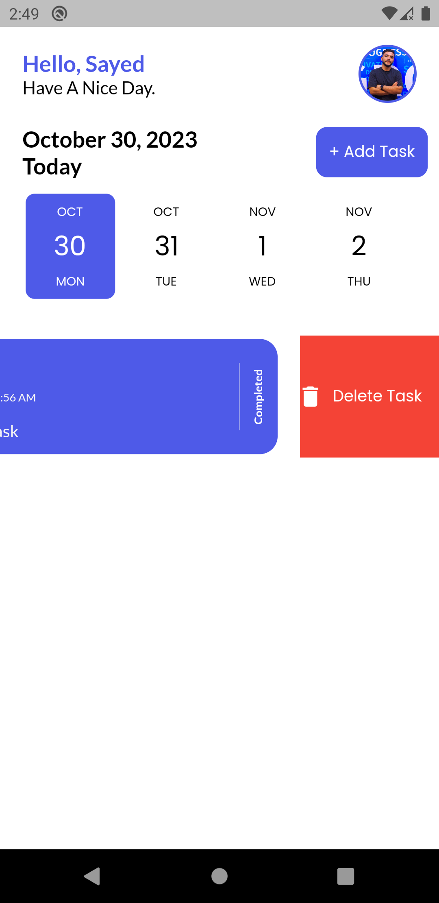
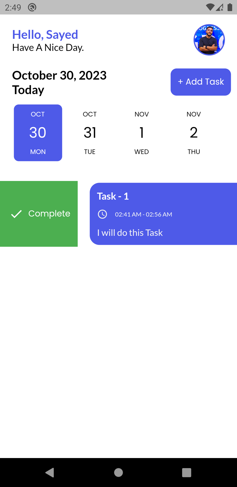
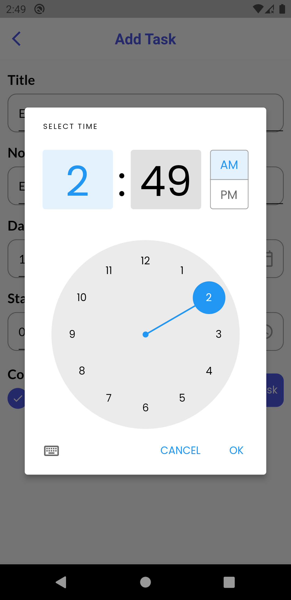
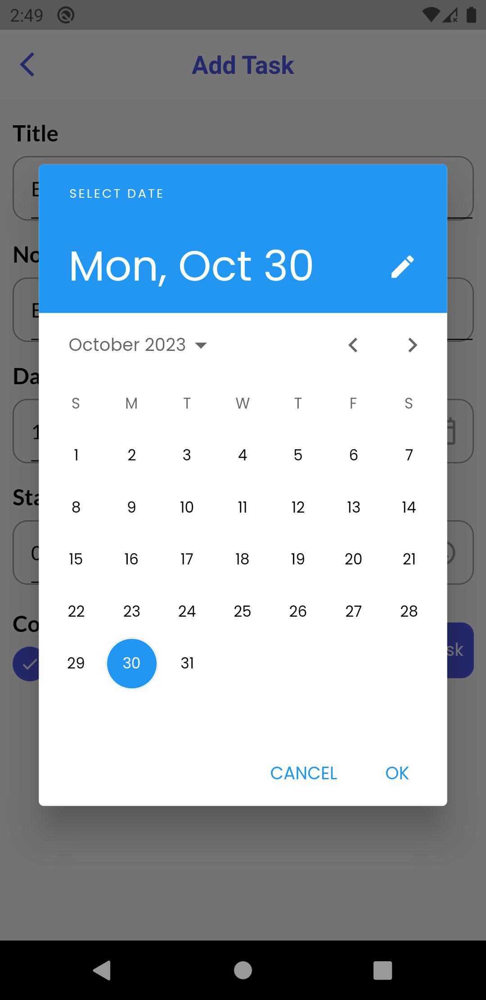

# 📱 Taskati App  

Taskati is a simple and user-friendly task management application that helps you organize your day and keep track of your important tasks.  

---

## ✨ Features
- Add, edit, and delete tasks ✅  
- Set start and end time for each task ⏰  
- Mark tasks as Complete or Incomplete 🟢  
- Clean and modern user interface 🎨  

---

## 📸 Screenshots  

### 🏠 Home Screen

  
  
  

### ➕ Add Task Screen

  
  
  

### 👤 Profile Screen

  

